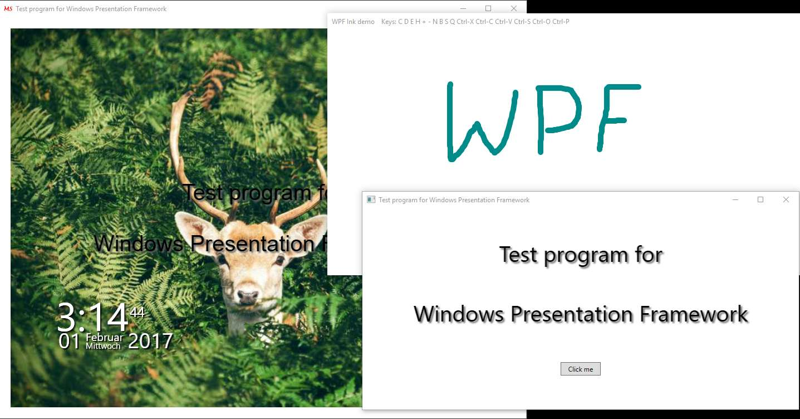

# Tutorial: Graphical WPF programs in C# with just one source file
Have you been already annoyed that you need Visual Studio or MSBuild to create WPF programs?

Here is a small - and not really honest - tutorial of C# WPF programs that can be compiled without Visual Studio or MSBuild.

Since Technet Gallery will be closed, now here.

See Script Center version: [Tutorial: Graphical WPF programs in C# with just one source file](https://gallery.technet.microsoft.com/Fun-Tutorial-Graphical-WPF-1f9047e4).

## Prerequsite:
.Net 3.5x and/or .Net 4.x

## How to compile the programs?

### .Net 4.x:
```bat
%WINDIR%\Microsoft.NET\Framework\v4.0.30319\csc.exe /target:winexe SOURCEFILE.cs /r:"%ProgramFiles%\Reference Assemblies\Microsoft\Framework\v3.0\presentationframework.dll" /r:"%ProgramFiles%\Reference Assemblies\Microsoft\Framework\v3.0\windowsbase.dll" /r:"%ProgramFiles%\Reference Assemblies\Microsoft\Framework\v3.0\presentationcore.dll"
```

### .Net 3.5x:
```bat
%WINDIR%\Microsoft.NET\Framework\v3.5\csc.exe /target:winexe SOURCEFILE.cs /r:"%ProgramFiles%\Reference Assemblies\Microsoft\Framework\v3.0\presentationframework.dll" /r:"%ProgramFiles%\Reference Assemblies\Microsoft\Framework\v3.0\windowsbase.dll" /r:"%ProgramFiles%\Reference Assemblies\Microsoft\Framework\v3.0\presentationcore.dll"
```

or use the batch file **Compile.bat** in the archive.



## Programs
### Demo 1: 01 Window.cs
Minimal WPF program: a window with text.

### Demo 2: 02 Mouseclick.cs
Program to execute mouse functions and to query the keyboard with event handlers.

### Demo 3: 03 Button.cs
Program to execute button functions.

### Demo 4: 04 Window Without XAML.cs
Minimal WPF program without XAML: a window with text.

### Demo 5: 05 Bitmap Icon.cs
Program to show how to use icons and graphics.

The images are defined as Base64 strings in the source code, so there is no dependency to other files (important :-) ).

Also a test for your favorite text editor, since the images are in one line in source code.

Deer graphic from: [Unsplash](https://unsplash.com/)

### Demo 6: 06 Clock.cs
Clock program: timer, transparent window, diverse event handlers, setting of the color with commandline parameters.

Try (for your daughter):

```bat
"06 Clock.exe" Magenta Violet Purple
```

### Demo 7: 07 InkCanvas.cs
Demo program: Ink window with Save and Load functions.

Have fun!

## Remark:
Does anybody know a way to read in custom classes in the XAML file (e.g., x:class = "CustomWindow") with XamlReader?
